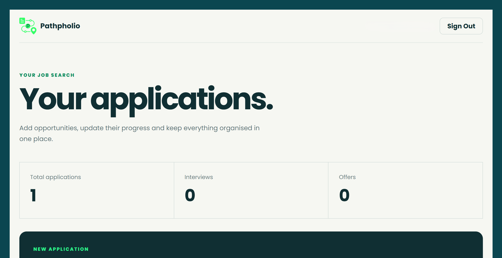
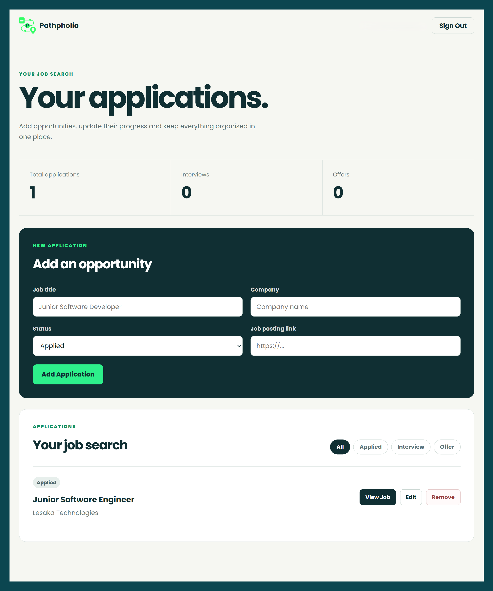
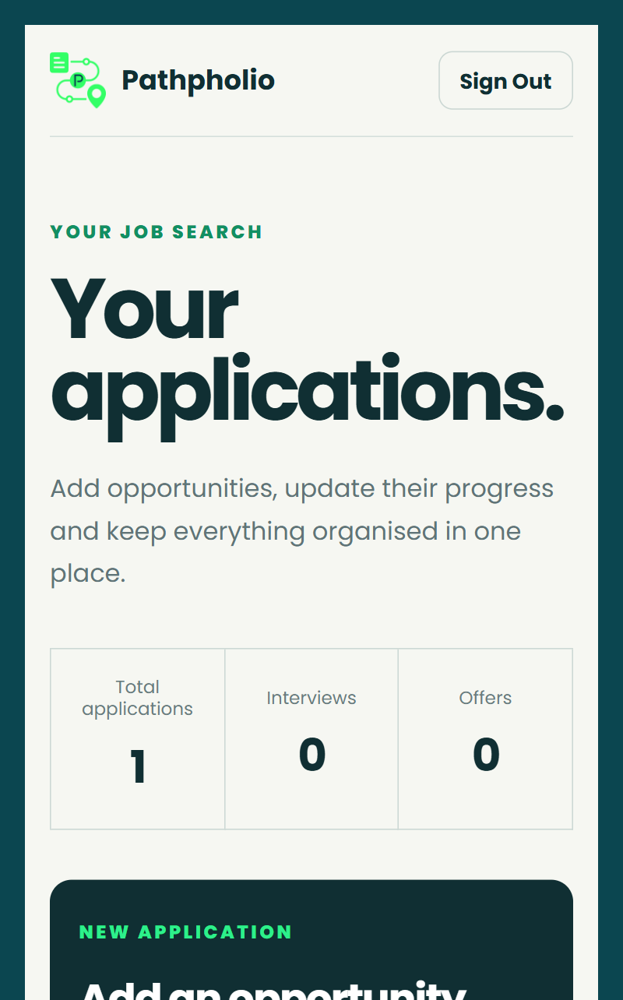

# Pathpholio

A modern job application tracker for organising opportunities, following application progress, and keeping important job-posting links in one place.

**Live Demo:** https://pathpholio.netlify.app 

---

## Overview

Pathpholio is a React-based job application tracker built to make the job-search process easier to organise.

Users can create an account, securely sign in, save job applications, update their progress, filter applications by status, and access their saved information across authenticated sessions.

The project combines a public product website with a functional, database-backed application.

---

## Features

* Email and password authentication
* Google OAuth sign-in
* Forgot password and password recovery
* Show/hide password controls
* Persistent authenticated sessions
* Add job applications
* Edit existing applications
* Delete applications with confirmation
* Track application status
* Filter applications by status
* Save original job-posting links
* Real application statistics
* Responsive desktop and mobile interface
* Loading, empty, success and error states
* Protected application routes
* Custom 404 page
* Accessible form controls and navigation

---

## Application Statuses

Applications can currently be tracked as:

* Applied
* Interview
* Offer

---

## Tech Stack

### Frontend

* React
* JavaScript
* React Router
* Vite
* CSS

### Backend & Authentication

* Supabase
* Supabase Authentication
* Supabase Database
* Google OAuth

### Deployment

* Netlify

---

## Screenshots

### Dashboard



### Application Tracking



### Mobile Dashboard



---

## Project Structure

```text
src/
├── components/
│   ├── Filters.jsx
│   ├── Header.jsx
│   ├── JobForm.jsx
│   ├── JobTable.jsx
│   └── Toast.jsx
│
├── pages/
│   ├── Auth.jsx
│   ├── Dashboard.jsx
│   ├── ForgotPassword.jsx
│   ├── Landing.jsx
│   ├── NotFound.jsx
│   └── ResetPassword.jsx
│
├── services/
│   ├── jobsApi.js
│   └── supabase.js
│
├── styles/
│   ├── auth.css
│   ├── dashboard.css
│   ├── global.css
│   ├── landing.css
│   └── not-found.css
│
├── App.jsx
└── main.jsx
```

---

## How It Works

1. A user creates an account using email and password or continues with Google.
2. Supabase handles authentication and session management.
3. Authenticated users enter the Pathpholio dashboard.
4. Job applications are stored in Supabase.
5. Users can create, update, filter and remove application records.
6. Saved applications remain available across authenticated sessions.

---

## Authentication

Pathpholio supports multiple authentication flows:

### Email and Password

Users can create an account and sign in using their email address and password.

### Google OAuth

Users can also authenticate using their Google account through Supabase OAuth integration.

### Password Recovery

Users who forget their password can request a reset email and create a new password through the dedicated recovery flow.

---

## Environment Variables

Create a `.env` file in the project root:

```env
VITE_SUPABASE_URL=your_supabase_project_url
VITE_SUPABASE_ANON_KEY=your_supabase_anon_key
```

The `.env` file is excluded from Git.

Never commit private credentials or Supabase service-role keys.

---

## Installation

Clone the repository:

```bash
git clone https://github.com/gititbunny/pathpholio.git
```

Enter the project directory:

```bash
cd pathpholio
```

Install dependencies:

```bash
npm install
```

Create your `.env` file and add the required Supabase environment variables.

Start the development server:

```bash
npm run dev
```

Open the localhost URL provided by Vite.

---

## Available Scripts

Start the development server:

```bash
npm run dev
```

Run ESLint:

```bash
npm run lint
```

Create a production build:

```bash
npm run build
```

Preview the production build locally:

```bash
npm run preview
```

---

## Deployment

Pathpholio is deployed through Netlify.

The project includes an SPA redirect configuration so React Router routes continue to work when pages such as `/app`, `/auth`, or `/reset-password` are opened directly.

---

## Responsive Design

Pathpholio was designed for both desktop and mobile use.

The interface adapts across screen sizes, including:

* Responsive landing-page sections
* Mobile-friendly authentication
* Compact dashboard statistics
* Responsive application cards
* Mobile-friendly forms and filters
* Flexible action buttons

---

## Accessibility

Accessibility improvements include:

* Semantic form labels
* Keyboard-focus styles
* Accessible password visibility controls
* Status and error messages using appropriate ARIA roles
* Descriptive image alt text
* Accessible navigation and buttons
* Responsive controls with usable touch targets

---

## SEO

The public Pathpholio product website includes:

* Page title and meta description
* Canonical URL
* Open Graph metadata
* Social-sharing image
* Twitter/X card metadata
* `robots.txt`
* `sitemap.xml`

Private application and authentication routes are excluded from search-engine indexing through the robots configuration.

---

## Development Focus

Pathpholio demonstrates practical experience with:

* React application architecture
* Component-based development
* Client-side routing
* Authentication
* OAuth integration
* Password recovery
* Database-backed CRUD operations
* Asynchronous data handling
* Form handling and validation
* Loading and error states
* Responsive development
* Accessibility
* SEO fundamentals
* Git and GitHub
* Netlify deployment
* Supabase integration

---

## What I Improved

The original version of Pathpholio began as a functional job-tracking application.

The project was later expanded and refined to include:

* A dedicated public product website
* Improved project structure
* Redesigned authentication pages
* Google OAuth
* Password recovery
* Improved mobile responsiveness
* A redesigned application dashboard
* Better loading, empty and error states
* Improved accessibility
* SEO configuration
* Cleaner deployment structure
* Improved GitHub presentation

The goal was to preserve the working application while improving its architecture, usability and overall product experience.

---

## Author

Built by **Git It Bunny**

GitHub: https://github.com/gititbunny
